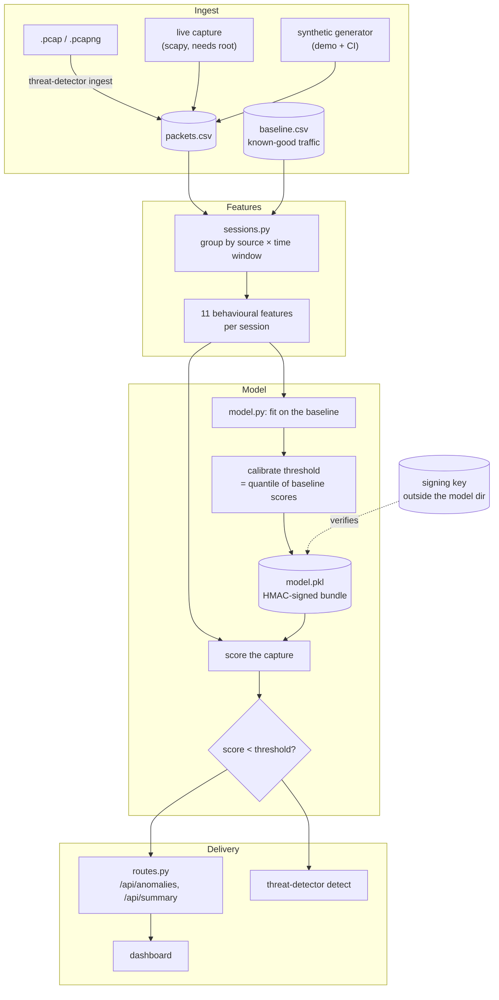
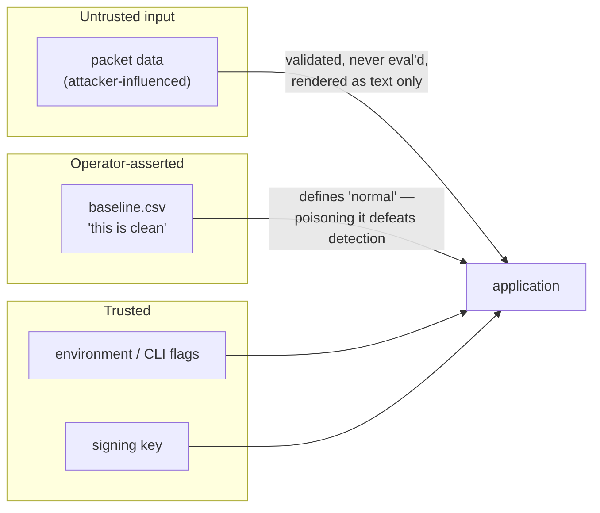

# Architecture

## What this is meant to do

Given a capture of network traffic, find the hosts behaving in ways that do not
match how the network normally behaves, and rank them so a person can look at
the top of the list first.

That sentence contains the three commitments the design is accountable to:

1. **Behaviour, not packets.** The unit of judgement is a host over a period of
   time, because that is the smallest thing an attack is visible in.
2. **Compared against normal.** "Normal" is learned from a capture you assert is
   clean, not from the traffic under suspicion.
3. **Ranked, and quiet when there is nothing to say.** A detector that always
   emits alerts is a random number generator with extra steps.

### What it is explicitly not

Not an IDS. It does not run inline, does not block anything, has no rules, no
signatures, no threat intelligence, and cannot name what it found. It reads a
CSV after the fact and says "this host looks unlike the others". Treat its
output as a queue of things to look at, never as a verdict.

## The shape of the system



## Why sessions and not packets

A single packet carries almost no evidence. A port-scan packet is a small TCP
packet; so is an ACK. Scanning, sweeping, beaconing and exfiltration are
*patterns across packets*, and scoring one packet at a time destroys exactly the
structure that identifies them.

| Feature | What it exposes |
|---|---|
| `packets`, `bytes_total` | bulk transfer, exfiltration |
| `mean_length`, `std_length` | uniform payload sizes — a machine-generated tell |
| `distinct_dst_ips` | host sweeps, lateral movement |
| `distinct_dst_ports` | port scans |
| `distinct_protocols` | protocol hopping |
| `mean_interarrival`, `std_interarrival` | beaconing — near-zero deviation is a timer, not a person |
| `small_packet_ratio` | scan and probe traffic |
| `external_dst_ratio` | traffic leaving RFC1918 space |

Measured on a capture with four planted attacks, each built so no individual
packet is unusual:

| | per-packet | per-session |
|---|---|---|
| Attacks found | 2 of 4, never the port scan | **4 of 4, in 12 of 12 runs** |
| Alerts to review | 346 | **7** |
| Alerts on clean traffic | 4, all false | **2 — the calibrated budget** |

## Why it fits on a baseline

Fitting on the capture under inspection teaches the model that whatever attack
is in there is part of normal. It also anchors the score distribution to the
attacker, which is why a fixed threshold cannot work: when this was measured,
clean traffic's own worst session scored **−0.167** while the worst attack
scored **−0.124**. There was no number between them. Scores are only comparable
within one fitted model, so the threshold is calibrated per model, against the
baseline.

```mermaid
sequenceDiagram
    participant O as Operator
    participant T as train
    participant D as detect
    O->>T: baseline.csv (asserted clean)
    T->>T: fit; score the baseline
    T->>T: threshold = quantile(baseline scores, q)
    T-->>O: signed bundle with its threshold
    O->>D: packets.csv (under suspicion)
    D->>D: score with the same model
    D-->>O: sessions below the threshold, worst first
```

`q` is a **target false-positive rate**: the threshold sits at that quantile of
the baseline's own scores, so `q = 0.02` means "accept about 2% of known-good
sessions alarming". That is an operating point on the ROC curve, and it was
chosen by measurement rather than taste — across eight independent baselines,
`0.02` caught all four reference attacks every time, while `0.0` managed it in
six of eight.

Without a baseline there is nothing to calibrate against, so the app falls back
to a quota over the inspected traffic and logs a warning. A quota is not
detection — it is a fixed alert budget — and it exists only so a first run does
something.

### The calibration trap

Calibrating at the exact minimum makes the threshold hostage to the single
weirdest session in the baseline. In practice that was a **one-packet window**
at the edge of the capture — an artifact of where recording started, not
behaviour — which scored so low that a 200-host sweep slipped under it.
`MIN_SESSION_PACKETS` (default 3) drops windows too small to describe
behaviour before fitting. That one change moved detection from 2 of 4 attacks
to 4 of 4.

`MIN_SESSION_PACKETS` removes the most common artifact, but not the general
problem: at `q = 0.0` the threshold is *always* the single lowest baseline
score, whatever that happens to be. A 4-packet session scoring 0.147 below
everything else was still enough to hide three of four attacks. That is why the
default rate is not zero, and why training warns when one session is visibly
deciding the bar.

The general lesson is in the code as a comment, because it will recur: **any
statistic taken at the extreme of a small sample is set by its worst
artifact.**

## Module map

| Module | Responsibility | Depends on |
|---|---|---|
| `config.py` | every setting, all from env, validated at construction | — |
| `features.py` | CSV loading, validation, per-packet features | config |
| `sessions.py` | per-source windowed behavioural features | features |
| `model.py` | fit, calibrate, score, summarise, cache | features, sessions, integrity |
| `integrity.py` | sign and verify the model before unpickling | — |
| `jobs.py` | background training, state on disk | config |
| `auth.py` | host check, CSRF, token, response headers | config |
| `routes.py` | HTTP only; no logic | model, jobs |
| `cli.py` | the operator-facing surface | everything |
| `synth.py`, `pcap.py` | getting data in | config |
| `selfcheck.py` | proves detection still works; runs in CI | model, synth |

The rule the layering enforces: **`routes.py` contains no decisions.** Anything
it does, the CLI must be able to do too, which is what keeps the tool usable
without a browser.

## Threat model

Who this is defending against, and what is out of scope.

| Asset | Threat | Control |
|---|---|---|
| The model file | Attacker writes a malicious pickle; `joblib.load` executes it | HMAC-SHA256 over the payload, verified **before** unpickling; key lives outside the model directory |
| The analysis | Anyone who can reach the port reads the network's traffic profile | `API_TOKEN` on `/api/*`; `serve` refuses a non-loopback bind without one |
| The service | A website the operator visits POSTs to `127.0.0.1` | Custom header required on state-changing requests, forcing a CORS preflight |
| The service | DNS rebinding points a hostile domain at the port | `Host` header allowlist |
| The operator's browser | Injected content from packet data executing as script | CSP; all rendering via `textContent` / `createElementNS` |
| Availability | Training request never returns; overlapping runs corrupt the model | Background jobs, single-flight, atomic model replace |

**Out of scope, stated plainly.** A poisoned baseline — if the attacker is
already in the traffic you fit on, they are normal by definition. An operator
who sets `ALLOWED_HOSTS=*` and `API_TOKEN` empty on a routable interface. The
capture pipeline itself: this tool trusts the CSV it is given.

## Data and trust boundaries



Packet fields reach the browser and the terminal, so they are treated as hostile
text everywhere: no `innerHTML`, no shell interpolation, no `eval`. The baseline
is the weakest link by design — it is an assertion the operator makes, and the
system cannot check it.

## Performance envelope

Honest limits, since they decide whether this fits a given job:

- The capture is loaded into memory as a DataFrame. Roughly 1 GB of RAM per
  ~10 million packet rows; beyond that, split the capture by time.
- Session aggregation is `O(packets)`, scoring is `O(sessions × trees)`. On the
  6,900-packet demo the whole pipeline runs in well under a second.
- Scoring is memoised on `(model, capture)` file fingerprints, so the dashboard's
  two endpoints share one pass instead of scoring the capture twice per click.
- Training runs on a worker thread with state on disk, so it survives an HTTP
  timeout and is visible to every worker under gunicorn.
